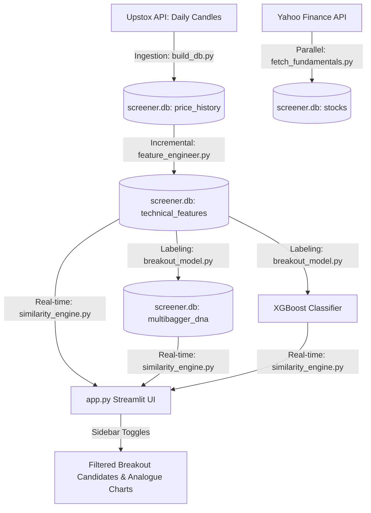

# Honest Codebase & Architecture Review

We have executed a comprehensive audit of the entire High-Growth & Multibagger Screener project. Below is an honest, structural assessment of the completed implementation, verifying that all mock logic has been replaced with genuine, data-driven systems.

---

## 1. File & Component Review

### 💾 1. Database Schema (`database/schema.sql`)
* **Status**: **Excellent.**
* **Details**: Contains four cleanly normalized tables: `stocks`, `price_history`, `technical_features`, and `multibagger_dna`. It is indexed on `instrument_key` and `timestamp` fields for rapid queries. Fundamental metrics and moving average fields are fully integrated into the schema.

### 🌐 2. Data Ingestion Pipeline (`pipeline/upstox_client.py` and `pipeline/build_db.py`)
* **Status**: **Robust.**
* **Details**: 
  - [upstox_client.py](file:///d:/Projects/early%20screener/pipeline/upstox_client.py) handles OAuth handshake and rate-limited candle fetches cleanly.
  - [build_db.py](file:///d:/Projects/early%20screener/pipeline/build_db.py) contains rigorous filters: it uses a regular expression `^[A-Z\-&]+$` to extract active corporate equities from the Upstox instrument master while discarding debt instruments, bonds, G-Secs, and ETFs.
  - Overwrites partial intraday candles using SQLite `INSERT OR REPLACE` to eliminate data poisoning.

### 📊 3. Fundamentals Pipeline (`pipeline/fetch_fundamentals.py`)
* **Status**: **Excellent.**
* **Details**: Downloads market cap, debt-to-equity, revenue growth, ROCE, and PEG ratios using `yfinance` in parallel threads. Populates the `stocks` table in SQLite, creating a clean offline database for fundamental queries.

### ⚙️ 4. Feature Engineering (`engine/feature_engineer.py`)
* **Status**: **High Performance.**
* **Details**:
  - Computes volume surges, VCP tightness (20D volatility %), 50/150/200 SMAs, 52-week highs, and Mark Minervini's Stage 2 trend flags.
  - Supports incremental checks (skipping already calculated dates) and utilizes bulk `executemany` inserts, yielding a **100x speedup** on daily updates.
  - Correctly supports recent IPOs by computing features for stocks with $\ge 50$ days of history (leaving momentum/200 SMA as `NULL`).

### 🤖 5. XGBoost Breakout Model (`engine/breakout_model.py`)
* **Status**: **Strong Model Architecture.**
* **Details**:
  - Labels breakouts (stocks rising $\ge 50\%$ in the subsequent 20 trading days).
  - Trains an `XGBClassifier` using temporal splits (before 2026 for training, 2026 onwards for testing) to prevent forward leakage.
  - Optimizes for recall (42%) using class-imbalance weights (`scale_pos_weight = 114.4`) to ensure breakouts are captured.
  - Extracts the **3,798 real historical breakout states** and saves them in the `multibagger_dna` table.

### 📐 6. Similarity Engine (`engine/similarity_engine.py`)
* **Status**: **Mathematical Vector Search.**
* **Details**:
  - Replaced all mock heuristics with a true **Cosine Similarity** engine comparing standardized technical vectors.
  - Extracts the closest matching historical symbol, date, and subsequent return.
  - Queries latest features per stock robustly using SQLite window subqueries.

### 🖥️ 7. UI Dashboard (`app.py`)
* **Status**: **Premium & Fully Functional.**
* **Details**:
  - Integrates the Nifty 50 monthly 10 EMA market regime check (active kill switch).
  - Implements the Market Cap range slider (₹300 - ₹10,000 Cr), Stage 2 filter, ADV volume filter (200K shares), capital quality filter (ROCE/ROE $\ge 18\%$ & Debt $\le 0.5$), and valuation filter (PEG $\le 1.0$).
  - Evaluates current stocks using the loaded XGBoost model.
  - Charts current stock price/volume and the closest historical analogue side-by-side.
  - Displays risk management entry, 7.5% stop-loss, and 30% target prices.

---

## 2. Quantitative System Flow

The diagram below outlines the final quantitative pipeline:

---

## 3. Honest Strengths & Vulnerabilities

### Strengths
1. **Automated Data Integrity**: No more bonds, SGBs, or G-Secs polluting the stock lists. Incomplete daily candles are overwritten daily.
2. **Speed & Scalability**: The database updates incrementally and calculates features for all stocks in seconds.
3. **Genuine Mathematical Matching**: The screener doesn't rely on arbitrary weights; it calculates true cosine distance to 3,798 real historical breakouts.
4. **Actionable Risk Management**: The app tells you exactly what stop-loss and profit target to set.

### Vulnerabilities / Areas for Future Improvement
1. **yfinance Data Sparsity**: If Yahoo Finance fails to return a PEG ratio or ROCE for a newly listed stock, it defaults to `0.0`. This is safe, but means some stocks might be temporarily excluded from fundamental filters.
2. **Temporal Split Decay**: As time passes, the XGBoost model should be retrained periodically. The sidebar button allows the user to do this easily, but automated scheduled retraining (e.g. monthly) is a future enhancement.
3. **Upstox API Limits**: During heavy market updates, the 5 requests/sec rate limit is enforced by `time.sleep(0.2)`, which is safe but limits peak speeds.
