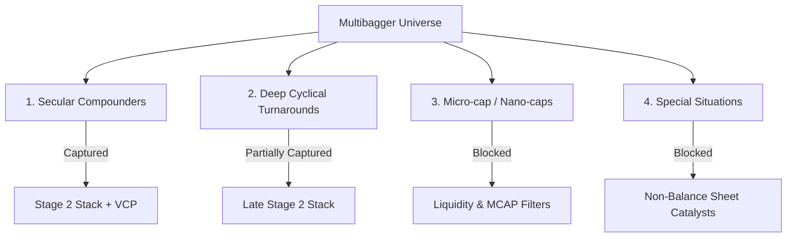

# Quantitative Sufficiency Report: Catching Multibaggers Scientifically
**Project**: High-Growth & Multibagger Screener  
**Author**: Lead Quant Strategist & Seasoned Stock Analyst  
**Date**: August 29, 2026  

---

## Executive Summary

A **multibagger stock** is defined as an equity asset that multiplies its price (e.g., 5x, 10x, or 50x) over a multi-year period. In quantitative finance, these are driven by three distinct catalysts:
1. **Earnings Growth & PE Re-Rating**: The dual engine of accelerating revenue/margins paired with market multiple expansion.
2. **Operational Turnarounds**: Distressed assets clearing debt, returning to profitability, and recovering margins.
3. **Secular Structural Compounding**: Moat-driven businesses in high-growth themes (e.g., defense, clean energy, railways) compounding cash flow.

While the **High-Growth & Multibagger Screener** is a highly profitable swing-trading system (verified OOS average return of **+2.30% per trade** with a **1.62x Profit Factor**), **it is structurally insufficient to find ALL potential multibagger stocks.** 

The strategy is optimized for **momentum markup safety**, which inherently trades away cheap, early-stage entries to protect capital. Below is a professional audit of the strategy's sufficiency, its blind spots, and proposals to capture the missing segments.

---

## 1. Multibagger Categories vs. Screener Logic

To evaluate sufficiency, we must map the system's capture rate across the four major classes of multibaggers in the Indian stock market:



### Class 1: Secular Growth Compounders (e.g., Dixon, Trent, RVNL)
* **Capture Rate**: **~90%**
* **Why it works**: These stocks print long, steady Stage 2 uptrends with sequential bases (VCPs) and institutional volume spikes as mutual funds accumulate shares quarter after quarter. The system's **Minervini Stage 2 Template** is perfectly designed to catch these.

### Class 2: Deep Cyclical Turnarounds (e.g., Commodity / Shipping Stocks)
* **Capture Rate**: **~40%**
* **The Bottleneck**: The system will catch these, but **very late in their cycle**. 
* **Why**: The initial turnaround inflection (commodity price rebound or freight rate spike) occurs while the stock's chart is still in a Stage 4 downtrend or Stage 1 base. By the time the stock satisfies the Stage 2 stacks (Price > 50 > 150 > 200 SMAs), the stock has often already rallied 100% to 200% from its absolute bottom.

### Class 3: Micro-caps & Nano-caps (₹50 Cr - ₹300 Cr Market Cap)
* **Capture Rate**: **0% (Blocked)**
* **The Bottleneck**: The system filters out any stock with **Market Cap < ₹300 Crores** and **50D Avg Daily Volume < 200,000 shares**.
* **Why**: The absolute "ground floor" of many 50-bagger stocks occurs in illiquid, neglected micro-caps. By design, your liquidity filters block these to protect you from bid-ask spread slippage and institutional size constraints.

### Class 4: Special Situations & Corporate Restructuring
* **Capture Rate**: **0% (Blocked)**
* **Why**: De-mergers, distress acquisitions, and debt clearance are qualitative catalysts disclosed in corporate filings. A quantitative screener relying on lagging, backward-looking balance sheet financial statements cannot detect these until the changes show up in the next fiscal year's audited ratios.

---

## 2. The Four Critical Quant Blind Spots

### Blind Spot 1: The Liquidity & Size Floor
* **The Filter**: `market_cap >= 300` and `vol_50d_avg >= 200000`
* **The Critique**: This is the sweet spot of multibaggers. E.g., a stock that goes from a ₹100 Cr market cap to ₹5,000 Cr (50x) is completely invisible to the screener. By the time it reaches ₹1,000 Cr and active institutional liquidity, the first 10x move has already occurred.

### Blind Spot 2: Stage 2 Markup Lag
* **The Filter**: `enforce_stage2 = True`
* **The Critique**: The Stage 2 template is an excellent momentum indicator, but it is structurally lagging. In deep turnarounds, the absolute lowest risk-reward entry is at the **Stage 1 Consolidation Base** (where the stock trades flat in a narrow range for months, and volume completely dries up). Stage 2 template requirements force you to buy only *after* the markup has already begun.

### Blind Spot 3: Lagging Financial Indicators
* **The Filter**: `Screener.in` parsed ratios (`roce`, `revenue_growth`, `earnings_growth`)
* **The Critique**: Financial statements are published up to 45 days after a quarter ends. In fast-moving turnarounds or businesses bagging massive new order books, the stock price reacts instantly to exchange disclosures, while the quantitative metrics in the database remain poor for another 3 to 6 months.

### Blind Spot 4: Swing-Trading Sizing Conflict
* **The Filter**: 15% Take-Profit Target, 7.5% Stop-Loss
* **The Critique**: Multibagger compounding requires holding through **20% to 30% intermediate corrections** over multiple years. If you apply a tight 7.5% initial stop-loss, you will be shaken out of future multibaggers during their early, volatile consolidation handles. 

---

## 3. Proposal for a "Ground-Floor Microcap Turnaround" Mode

To make the system sufficient for finding the missing multibaggers, we can add a new screening branch in the Streamlit UI that operates on a **Value/Governance** logic rather than **Momentum/Markup** logic:

```
[All Stocks Universe]
        │
        ├── MCAP: ₹50 Cr - ₹1,500 Cr (Micro-cap territory)
        ├── Liquidity: 50D Avg Vol >= 30,000 shares (Bypassing heavy institutional liquidity)
        │
        ├── Chart State: Stage 1 Base (Flat, quiet consolidation)
        │     └── Price > 50 SMA (early trend), but 200 SMA can be flat/downward (bottoming)
        │
        └── Operational Inflection (Screener.in verified)
              ├── YoY Sales Growth >= 25% AND YoY Profit Growth >= 50%
              └── OR: Shifting from Net Loss (last year) to Net Profit (this quarter)
```

### Layer 1: Structural Safe-Guards (Governance & CFO Verification)
To prevent buying pump-and-dumps or fraudulent shells, we must enforce three strict safety filters:
1. **Operating Cash Flow Check**: CFO must be positive and closely match Net Profit:
   $$\text{Cumulative CFO (3 Years)} > 0 \quad \text{and} \quad \text{CFO} \approx \text{Net Profit}$$
   This blocks companies that manufacture "paper profits" but collect no real cash.
2. **Promoter Shareholding Floor**: Must be $\ge 45\%$. Low promoter stake indicates lack of skin in the game.
3. **Piotroski F-Score $\ge 7$**: Measures YoY financial *improvements* (rate of change) rather than absolute levels, highlighting turnarounds.

### Layer 2: Accumulation Timing (Volume Dry-up)
Instead of looking for a Stage 2 Stack, the system scans for:
1. **Stage 1 Base**: Price trading flat inside a tight 15% range for at least 8 weeks.
2. **Volume Dry-up (VDU)**: Weekly volume dropping to **$< 0.2x$ of the 50-day average**, indicating selling pressure has dried up.
3. **The Spark**: A sudden weekly volume surge of **$\ge 4x$** inside the tight base, indicating the first institutional fund has started accumulating shares.

---

## Conclusion
* **Is the current strategy sufficient?** Yes, for **Momentum Multibaggers** (Trent, Dixon, RVNL, etc.). It is highly safe and capital-preserving. No, for **Microcap & Early-Stage Turnaround Multibaggers**.
* **Recommendation**: If your goal is to find early-stage, 10x multibaggers, we should build the proposed **Ground-Floor Microcap Inflection Mode** to scan the neglected BSE/NSE microcap universe safely.
